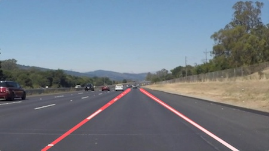

# **Finding Lane Lines on the Road** 

## Overview
When we drive, we use our eyes to decide where to go.  The lines on the road that show us where the lanes are act as our constant reference for where to steer the vehicle.  Naturally, one of the first things we would like to do in developing a self-driving car is to automatically detect lane lines using an algorithm.

In this project, I detected highway lane lines on a video stream and used OpencV image analysis techniques to identify lines, including Hough Transforms and Canny edge detection.

You can check out the new advanced version of this project [here](https://github.com/Michael-Tu/Udacity-Self-Driving-Car/tree/master/p4-advanced-lane-finding).

## Get the Code
You can download this folder of code [here](https://tugan0329.bitbucket.io/downloads/udacity/car/land-line/p1-finding-land-line.zip)

## Working Examples
Here are two videos of my working land line detection pipeline:

- [EXAMPLE 1](https://youtu.be/WvMjKvKvMR0)
- [EXAMPLE 2](https://youtu.be/_ANL75vW-2g)

[//]: # (Image References)

[image1]: ./examples/grayscale.jpg "Grayscale"
[image2]: ./examples/line-segments-example.jpg "Line Segment Example"
[image3]: ./test_images_output/solidYellowCurve.jpg "solidYellowCurve"
[image4]: ./test_images_output/whiteCarLaneSwitch.jpg "whiteCarLaneSwitch"
[image5]: ./test_images_output/solidWhiteCurve.jpg "solidWhiteCurve"
[image6]: ./test_images_output/solidYellowCurve2.jpg "solidYellowCurve2"
[image7]: ./test_images_output/solidYellowLeft.jpg "solidYellowLeft"
[image8]: ./test_images_output/solidWhiteRight.jpg "solidWhiteRight"

## Techniques

### Main Pipeline
My pipeline consisted of 5 steps. 

First, I converted the images to grayscale. 

![alt text][image1]

Then, I apply an gaussian blur of `kernal size 7` to reduce the noise of the image. 

After that, I apply a Canny Edge Detection with `low threshold of 50` and 	`high threshold of 150`to separate the edges out. 

Later, I apply a mask region of lower bottom half to filter out only the edges that are most likely to be land lines. 

At last, I use a Hough Line Transform (`rho = 1`, `theta = np.pi/180`, `threshold = 5`, `min_landline_length = 20`, `max_line_gap = 5`) to further detect land lines.

Up until this point, if we draw the lines selected after Hough Line Transform, we will find them to be segmented like so:

![alt text][image2]

### Further Work

In order to draw a single line on the left and right lanes, I modified the `draw_lines()` function to identify the full extent of the lane through line averaging and extrapolation.

I did so in 3 steps.

First, I go through all the lines selected by Hough Line Transform and then separate them into left lines and right lines.

Then, for each type of lines (i.e. left lines and right lines), I first remove the outliers that lay 1.5 times of the IQR (Interquartile Ranges) and then calculate the mean coordinates of these lines to get the averaged line of this type.

Last, I extrapolate the line to the estiamted full extent and length, and then draw both this extrapolated averaged left line and averaged right line with a `thickness of 10` as my landline overlay.

#### Examples of Improved Landline Detection
![alt text][image3]
![alt text][image5]
![alt text][image7]
![alt text][image8]

## Potential Shortcomings

One potential shortcoming would be what would happen when the land lines are turning (aka. has curves in them). Because I am mainly using line averaging and extrapolation techniques to detect and predict the full extent of the line, it will break when the lines are curved and turning.

Another shortcoming could be that when the lighting situation changes, or land lines are covered in snow/rain due to weather, the parameters used for my edge detection can break. It is not adaptable and flexible right now.

## Possible improvements

A possible improvement would be to have a low-degree polynomial functional fit for the lines detected instead of just line averaging and extrapolation. This can potentially solve the issue of failing when lines are turning/curved.

Another potential improvement could be to figure out some benchmark parameters, or incorporate some sensor information about weather and lighting, so the pipeline can dynamically calculate and adjust the parameters used for edge detections.

