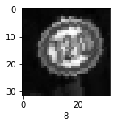
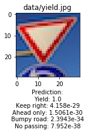
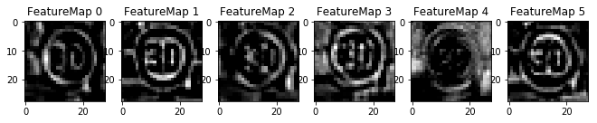

# Traffic Sign Recognition

[](http://www.udacity.com/drive)

## Overview

In this project, I will use what I've learned about deep neural networks and convolutional neural networks to classify traffic signs. I will train and validate a model so it can classify traffic sign images using the [German Traffic Sign Dataset](http://benchmark.ini.rub.de/?section=gtsrb&subsection=dataset). After the model is trained, I will then try out my model on images of German traffic signs that I find on the web.

**My model is able to achieve a validation accuracy of 94.6% and a test accuracy of 94%.**

## Dependencies
This project requires [CarND Term1 Starter Kit](https://github.com/udacity/CarND-Term1-Starter-Kit). The environment can be created with CarND Term1 Starter Kit. Click [here](https://github.com/udacity/CarND-Term1-Starter-Kit/blob/master/README.md) for the details.

## Dataset and Repository

1. Download the [data set](https://d17h27t6h515a5.cloudfront.net/topher/2017/February/5898cd6f_traffic-signs-data/traffic-signs-data.zip) and put them under the folder named `data`.
2. Download this [project repo](https://tugan0329.bitbucket.io/downloads/udacity/car/traffic-sign/p2-traffic-sign-classifier.zip)

## Detailed Model Description 

### Data Set Summary & Exploration

#### 1. Basic Summary

I used Python and numpy to calculate the following summary statistics of the traffic
signs data set:

* The size of training set is 34799.
* The size of the validation set is 4410
* The size of test set is 12630
* The shape of a traffic sign image is (32, 32, 3)
* The number of unique classes/labels in the data set is 43

#### 2. Exploratory Visualization

Here is an exploratory visualization of the data set. Here are the bar charts that show how the training, validation, and testing data all have similar distribution and slightly skwed to the right.


### Design and Test a Model Architecture

#### 1. Image Augmentation


As a **first** step, I decided to convert images to grayscale because the colors of traffic signs do not matter for this classification task, so converting to grayscale avoids false classification and complexities.

Here is an example of a traffic sign image before and after grayscaling.


As a **second** step, I normalized the image data so the pixel values have mean zero and equal variance in order to further reduce noise.

```
imgs = np.array([(x-x.min())/(x.max()-x.min()) for x in imgs])
```

Here is an example of a traffic sign image after normalization.


**However**, I also decided to generate additional data because our network should be able to classify traffic signs without the influence of lighting situations and camera perspectives in the training set.

To add more data to the the data set, I randomly adjust image brightness and contrast. I also apply random image rotation, sheer, zoom, and shifts using Keras. 

Here are the specifics of techniques used.

**First**, I randomly select a small batch of training images to adjust the image contrast and image brightness, because the network should be able to classify traffic signs regardless of the lighting situations. By randomly adjusting the contrast and brightness, we generate more training examples to simulate what traffic signs look like under different lighting effects.

Here is an example of a traffic sign image before and after contrast adjustment.


```
imgs = tf.image.adjust_contrast(imgs, 0.5)
```

Here is an example of a traffic sign image before and after brightness adjustment.


```
imgs = tf.image.adjust_brightness(imgs, 0.6)
```

**Second**, I randomly select a small batch of training images and apply random rotation, shear, zoom, width shift, and height shift. In this way, I generate additional noise and randomization to training images to better help network generalize. To accomplish this task, I use Keras's preprocessing tool.

```
from keras.preprocessing.image import ImageDataGenerator
datagen = ImageDataGenerator(
        rotation_range=30,
        shear_range=0.2,
        zoom_range=0.2,
        width_shift_range=0.2,
        height_shift_range=0.2,
        fill_mode="nearest")
```

Here is an example of a traffic sign image after Keras image manipulation.


**Third**, I convert these images also to grayscale and normalize them. Here are some examples of preprocessed data:




After image augmentation, the size of training set has increased from 34799 to 39019, but the distribution has remained similar: 


#### 2. Final Model Architecture

My final model consisted of the following layers:

| Layer | Description | 
|:------:|:----------:| 
| Input | 32x32x1 Graysclae image| 
| Convolution 5x5 | 1x1 stride, VALID padding, outputs 28x28x6 |
| RELU	|	Activation |
| Convolution 5x5 | 1x1 stride, VALID padding, outputs 24x24x16 |
| RELU	| Activation	|
| Max pooling	  | 2x2 stride,  outputs 12x12x16 |
| Convolution 5x5 | 1x1 stride, VALID padding, outputs 8x8x32 |
| RELU	|	Activation |
| Max pooling	  | 2x2 stride,  outputs 4x4x32 |
| Flatten | outputs 512|
| Fully connected | outputs 252|
| RELU	|	Activation |
| Dropout	| Keep probability of 0.5|
| Fully connected | outputs 84|
| RELU	|	Activation |
| Dropout	| Keep probability of 0.8|
| Softmax	| outputs 43|
 


#### 3. Training Model 

To train the model, I used an **AdamOptimizer**. Adam Optimizer works better than Gradient Descent Optimizer because Adam Optimizer separates learning rates for each weight as well as an exponentially decaying average of previous gradients. This is fairly memory efficient and is reputed to work well for both sparse matrices and noisy data.

Hyperparameters used are: **batch size of 256, Epochs of 40, and a learning rate of 0.002**. 

I didn't use regularization because I already have dropout layers and my network is not very deep. Batch size of 256 is generally a good default value, and it turns to work best in terms of convergence speed and overfitting, among batch sizes of 32, 64, 128, 256, and 512 that I've experimented.

I decided on 40 epochs and a learning rate of 0.002 through experimentation of epochs from 10 to 50 and learning rates from 0.001 to 0.1. My network generally achieves a steady 93%+ validation accuracy after 40 epochs with 0.002 learning rate.

#### 4. Model Results

**My final model results were:**

* **training set accuracy of 98.0%**
* **validation set accuracy of 94.6%**
* **test set accuracy of 94.0%**


I initially used LeNet architecture with batch size of 256, 10 Epochs, learning rate of 0.001.

```
(Conv + Relu + Pooling)x2 + Flatten + (Fully Connected + Relu) * 2 + Softmax
```

The performance is that my training and validation accuracy are close but generally below 90%, which is a sign of underfitting.

So, I experimented with a combination of increasing batch size, epochs, and learning rates.

However, my model then has a high training accuracy but low validation accuracy and validation accuracy starts to drop after a number of epochs. This is a sign of overfitting.

Thus, I added dropout layers after both fully connected layers and added l2 regularization to avoid overfitting, but the performance suggested underfitting again. The network didn't improve even if I got rid of l2 regularization to loosen up regularization. Thus, it means I need a deeper network.

I tried a deep network structure suggested by Stanford CS231N class:

```
(Conv + Relu + Conv + Relu + Pooling)x3 + Flatten + (Fully Connected + Relu) * 2 + Softmax
```

However, it seems to perform even worse than easier models, regardless of hyperparameter tuning and regularization techniques. I also researched online and found several architectures with good performances, but somehow I am unable to recreate the performance. This is probably that my image augmentation and preprocessing work is not very good.

Thus, I went back to the LeNet structure but only added one more convolutional layer without pooling at the first, and increased output sizes of the convolutional layers. With initial hyperparameter defaults, the network generally achieves an accuracy of 92% after 30 epochs and 0.001 learning rate, so I increased to 40 epochs and 0.002 learning rate to achieve 94.6%+ validation accuracy.

### Test a Model on New Images

#### 1. Five German traffic signs found on the web

Here are five German traffic signs that I found on the web.


I chose these images because some of them are similar in shapes (two rounds, two triangles, etc.) and the photos are taken from different perspectives.

#### 2. Model's Predictions on new traffic signs.

Here are the results of the prediction:

| Image | Prediction | 
|:----:|:-------------:| 
| Yield | Yield |
| Priority Road | Keep Right | 
| Speed Limit 30 | Speed Limit 30 |
| No Passing | No Passing |


The model was able to correctly guess 4 of the 5 traffic signs, which gives an accuracy of 80%. This compares not as good to the accuracy on the test set of 94.0%. This slightly worse performance happened probably due to not enough training examples for "keep right", if you at the distribution of labels in the training set. This results in network learning incomplete representation of "keep right" sign, or overfitting. 

#### 3.Top 5 softmax probabilities for each image along with the sign type of each probability. 

For all images, the model is relatively sure of its predictoin. The top 5 softmax probabilities for each image, and their the predicted sign types are as follows:




### Visualizing the Neural Network 

Here are the visualization of the **first convolutional layer features** for each of the 5 new images:





As we can see, the network does a relatively good job at extracting the characteristics of each traffic sign: shape, edges, letters, etc.
