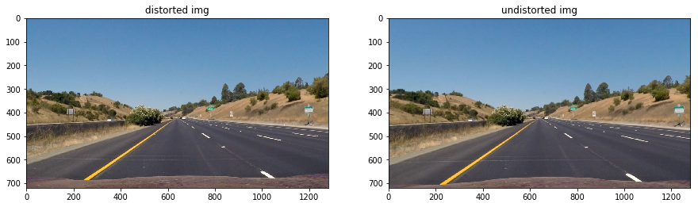
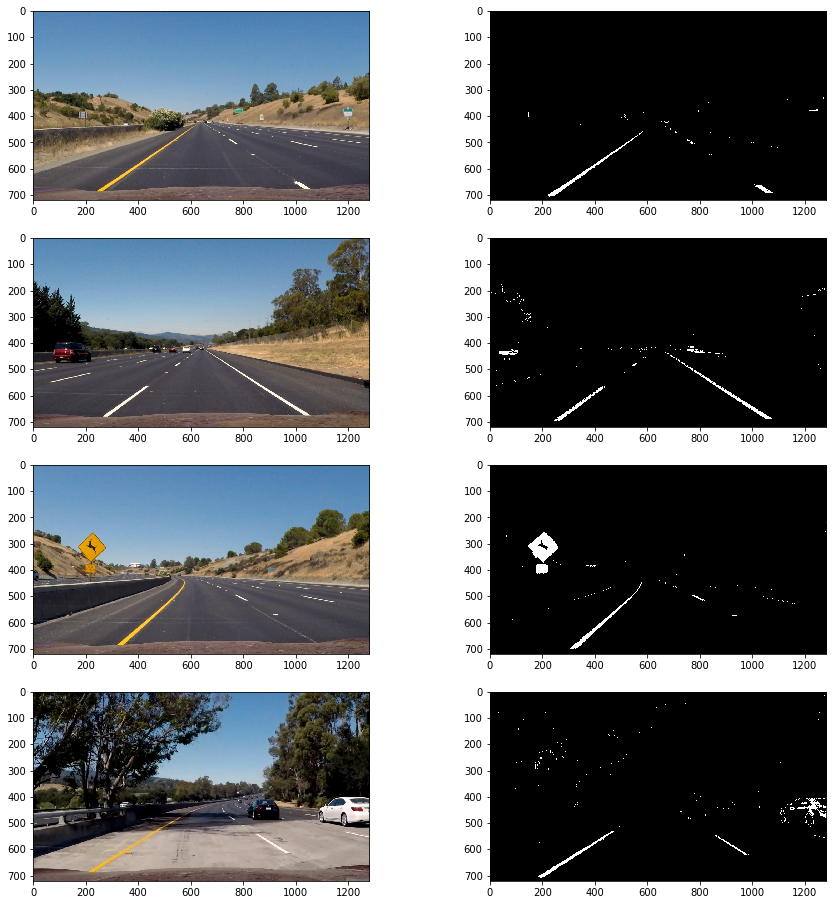
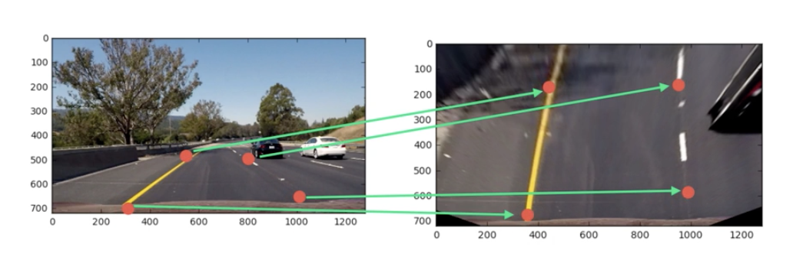
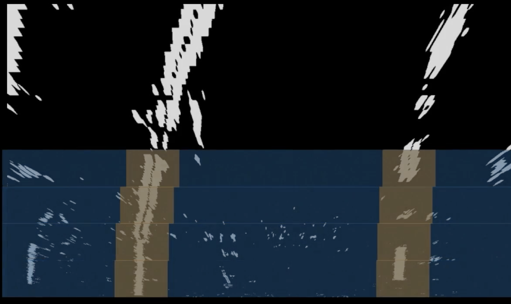

# Advanced Lane Finding

## Overview

When we drive, we use our eyes to decide where to go. The lines on the road that show us where the lanes are act as our constant reference for where to steer the vehicle. Naturally, one of the first things we would like to do in developing a self-driving car is to automatically detect lane lines using an algorithm.

In this project, my goal is to improve the 'p1-finding-lane-line' project and to write a software pipeline to identify the lane boundaries in a video from a front-facing camera on a car with higher accuracy including curved lanes.

You can check out the previous naive version of this project [here](http://code.tugan.me/finding-lane-line).

## Project Demo

You can also watch a demo video of this project [on my YouTube](https://youtu.be/Lw5kBiCGr-g)

## Get the Code
You can download this folder of code [here](https://tugan0329.bitbucket.io/downloads/udacity/car/land-line/p4-advanced-lane-finding.zip)

## Overview Pipeline

The general steps of this project are the following:

* Compute the camera calibration matrix and distortion coefficients given a set of chessboard images.
* Apply a distortion correction to raw images.
* Use color transforms, gradients, etc., to create a thresholded binary image.
* Apply a perspective transform to rectify binary image ("birds-eye view").
* Detect lane pixels and fit to find the lane boundary.
* Determine the curvature of the lane and vehicle position with respect to center.
* Warp the detected lane boundaries back onto the original image.
* Output visual display of the lane boundaries and numerical estimation of lane curvature and vehicle position.

## Detaild Proejct Explanation

### Step 1: Camera Calibration

In real world, camera is not perfect, and different cameras often distort images in different ways. For example, fish-lense camera makes objects on the edge really distorted. One consequence of this effect is that items in the image may appear to be further or closer than in the real world, and it is pretty problematic for a task like autonomus driving for various safety concerns. So, we will first calibrate the front cameras that are mounted in front of cars.

#### 1. Compute the camera matrix and distortion coefficients

_The code for this step is in the "Camera Calibration" section of the notebook._

The high level idea is to investigate how known patterns (i.e. chessboard pattern) get distorted by the camera, compute the distortion pattern, and apply a reverse transformation to get the original image back.

I start by preparing "object points", which will be the (x, y, z) coordinates of the chessboard corners in the world. Here I am assuming the chessboard is fixed on the (x, y) plane at z=0, such that the object points are the same for each calibration image.  Thus, `objp` is just a replicated array of coordinates, and `objpoints` will be appended with a copy of it every time I successfully detect all chessboard corners in a test image.  `imgpoints` will be appended with the (x, y) pixel position of each of the corners in the image plane with each successful chessboard detection.  

I then used the output `objpoints` and `imgpoints` to compute the camera calibration and distortion coefficients using the `cv2.calibrateCamera()` function. I will save the transformation matrix and other related parameters in a pickle file named `camera_cal.p` for future use.

### 2. Undistort images via parameter

We can apply distortion correction to images using the `cv2.undistort()` function. Here is an example result: 

---

### Step 2: Pipeline (single images)

#### 1. Undistort Camera Images

Using camera distortion coefficients calculated from last step, we will undistort all input image stream from the camera before we apply any image processing techniques. 

Here is a comparision of original distorted image and undistorted image. As you can see, the effect is pretty small for the human eye:

#### 2. Identify lines thorugh edge detection

_The code for this step is in the "Color Thresholding and Edge Detection" section of the notebook._

**Effect Demo**

Overall, I used a combination of color and gradient thresholds to generate binary images of edges present in an image. Here are some examples.

By applying different hyper-tuned thresholds, we can get cleaner images as well:

The effects demo above uses a combination of all of the mechanism and techniques described below, with tuned thresholds for each technique.

**Mechanism - Sobel Filter**

Sobel–Feldman operator is one common computer vision technique used for edge detection. 

You can learn more on [Wikipedia](https://en.wikipedia.org/wiki/Sobel_operator). 

Whenever there is an edge, there is usually a sharp pixel value gradient change. Thus, Sobel filter detects edges by computing the gradients of color change in between pixels, so I fine tuned thresholds on how much gradients can change (on x axis, y axis, combined gradient magnitude, etc.) to extract usable edges. 

**Mechanism - Alternative Color Space**

We do not have to solely operate in the RGB color space. As the demo below demonstrates, the edges are more visible and thus easier to extract in other color spaces. Specifically, my experiments showed the V (Value) channel of HSV color space, the L (Lightness) channel of LUV color space, and the S (Saturation) in HLS color space seems to work pretty well for our task.

**Mechnism Demo**

#### 3. Perspective Transform

_The code for this step is in the "Perspective Transform (Warping)" section of the notebook._

It is easier to calculate curvature, lane lines etc. from a top down view, instead of a perspective view, because from a top down view of the road, we can both ignore irrelevant edges (like trees) and compute a polynomial fit for the lanes. To do that, we will use perspective transform to transform the image to a top down view. Here is an example of how perspective transform works:

The code for my perspective transform includes a function called `unwarp()`, which takes an input image (`img`), and apply a perspective transform using given source (`src`) and destination (`dst`) points. 

Specifically, I chose to hard-code the source and destination points in the following manner as it turned to be the most effective:

| Source        | Destination   | 
|:-------------:|:-------------:| 
| 190,720      | 340,720       | 
| 589,457     | 340,0      |
| 698,457     | 995,0      |
| 1145,720      | 995, 720        |

I verified that my perspective transform was working as expected, and here are two examples:

#### 4. Identify Lane Line Pixels

_The code for this step is in the "Detect lane line and boundry" section of the notebook._

**Sliding Window Search**

After applying calibration, thresholding, and a perspective transform to a road image, I have a binary image  where the lane lines stand out clearly. 

To identify the lane lines, I first take a histogram along all the columns in the image, adding up the pixel values along each column in the image. In my thresholded binary image, pixels are either 0 or 1, so the two most prominent peaks in this histogram will be good indicators of the x-position of the base of the lane lines. 

I can use that as a starting point for where to search for the lines. From that point, I can use a sliding window, placed around the line centers, to find and follow the lines up to the top of the frame.

**Polynomial Fit**

Once I have detected the pixels associated to the lane line from above, I can fit a second degree polynomial to approximate the lane line:

**Effect Demo**

Here is an example where lane line pixels have been identified and fit with a polynomial:

#### 5. Calculate the radius of curvature of the lane and the position of the vehicle with respect to center

_The code for this step is in the "Detect lane line and boundry" section of the notebook. The function for curvature measurement is in `measure_curvature` function._

**Radius of Curvature**

We can report information of the road by taking the measurements of where the lane lines are and estimate how much the road is curving. Given a polynomial fit from above, I calculated the radius of curvature for the lane by following [this math tutorials](https://www.intmath.com/applications-differentiation/8-radius-curvature.php) 

Note that this radius is in pixel space, which is not the same as real world space, so I will repeat this calculation after converting our x and y values to real world space in meters, assuming the curve of the road follows a circle.

**Vehicle Position**

It can also be useful if we know where the vehicle is located with respect to the center of the lane. For example, this information can be useful when switching lanes etc.

For the position of the vehicle, I assume the camera is mounted at the center of the car and the deviation of the midpoint of the lane from the center of the image is the offset. Thus, I just take the average x axis pixel positions of left lane pixels and right lane pixels, and compare it to the center of the image.

As with the polynomial fitting, convert from pixels to meters.

#### 6. Plot lane line detection back on to the image

_The code for this step is in the "Fill Lane" section of the notebook._

Now, the fit from the rectified image has been warped back onto the original image and plotted to identify the lane boundaries. We can use the reverse perspective transform to plot the lane back to the original image. Here is an example:

---

### Pipeline (video)

To avoid extreme outliers for lane fitting, I will smooth over last 10 frames for left lane and right lane pixels detected to give smoother, stable polynomial fit.

Here is a gif demo:

You can also watch a demo video of this project [on my YouTube](https://youtu.be/Lw5kBiCGr-g)

---

## Discussion

This pipeline by no means is perfect. It is still very vulnerable to many abnormalities in real life, such as shaddows, lightings changes, window reflections, faded lane lines, etc. The polynomial fit will also fail especially when lines edges detected are not enough, so lines sometimes warbble or jump around. 

If I were to improve this pipeline, I will consider more techniques in smoothing to average the polynomials out. I will try to skip a fit if the lane-fit significantly differs from previous timestamps' fits, until a threshold is reached so I will recalculate the fit. I will also consider more robust techiniques for lane detection, than simple color thresholding and edge detection. For example, a Convolutional Neural Network. The goal will be try to identify lane lines under different lighting conditions.
