# Vehicle Detection and Tracking

## Overview
In this project, I'll write a software pipeline to identify vehicles in a video from a front-facing camera on a car. 

## Project Demo

You can also watch a demo video of this project [on my YouTube](https://youtu.be/ogwdGtVbd40)

## Get the Code
You can download this folder of code [here](https://tugan0329.bitbucket.io/downloads/udacity/car/vehicle-detection//p5-vehicle-detection-and-tracking.zip)

## Overview Pipeline

The general steps of this project are the following:

* Perform a Histogram of Oriented Gradients (HOG) feature extraction on a labeled training set of images and train a classifier Linear SVM classifier
* Apply a color transform and append binned color features, as well as histograms of color, to the HOG feature vector. 
* Implement a sliding-window technique and use the trained classifier to search for vehicles in images.
* Run the pipeline on a video stream and create a heat map of recurring detections frame by frame to reject outliers and follow detected vehicles.
* Estimate a bounding box for vehicles detected.

## Detaild Proejct Explanation

### Histogram of Oriented Gradients (HOG)

#### 1. Extract HOG features from training images.

_The code for this step is in the "Histogram of Oriented Gradients (HOG)" section of the notebook._

I started by reading in all the `vehicle` and `non-vehicle` images.  Here is an example of one of each of the `vehicle` and `non-vehicle` classes:

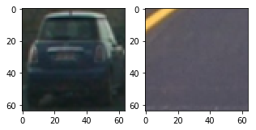

I then explored different color spaces and different `skimage.hog()` parameters (`orientations`, `pixels_per_cell`, and `cells_per_block`).  I grabbed random images from each of the two classes and displayed them to get a feel for what the `skimage.hog()` output looks like.

Here is an example using the `RGB` color space and HOG parameters of `orientations=8`, `pixels_per_cell=(8, 8)` and `cells_per_block=(2, 2)`:

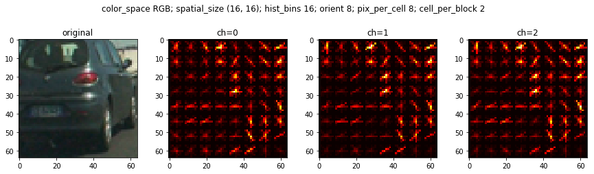

#### 2. Choice of HOG parameters.

_The code for this step is in the "Explore Different Hog Parameters" section of the notebook._

First, I tried various color spaces, and here are the results for each color space.

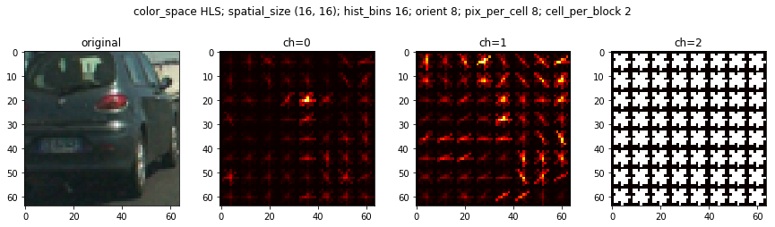

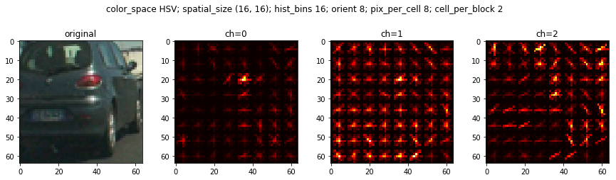

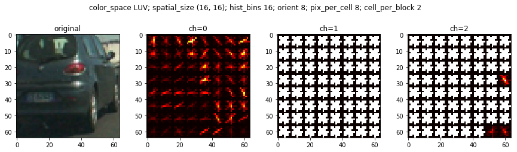

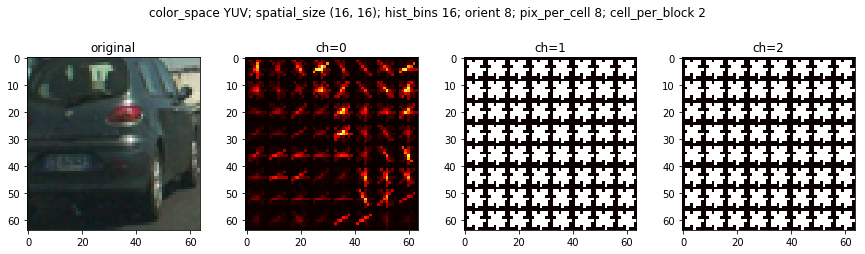

As we can see, RGB, LUV, YUY, and YCrCb first channels perform relatively well and similar to each other, as it depicts a gradient graph similar to a real car.

Then, I tried various combinations of parameters (`orientations, pixels_per_cell, cells_per_block`), and here are the results for each combination.

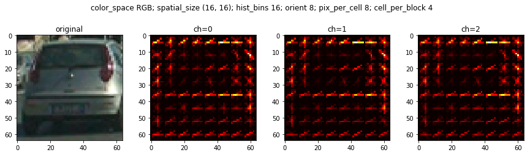

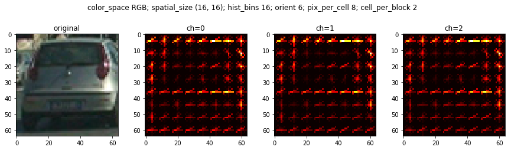

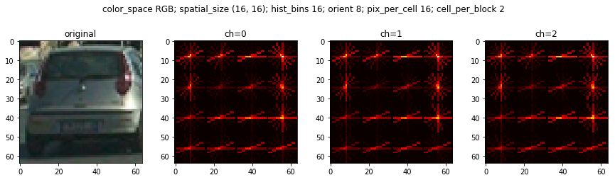

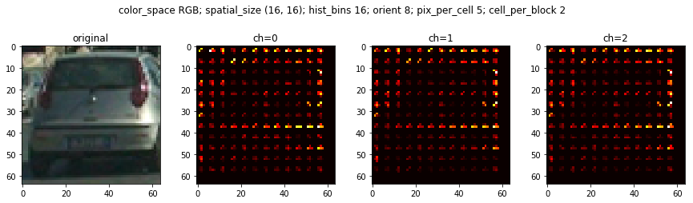

As we can see, cell_per_block doesn't have huge effect, but we definitely don't want too many orient nor pixel_per_cell.

Therefore, combining the results from these experiements, I decided to pursue with `YCrCb` color space, `(16,16)` spatial_size, `32` hist_bins, `9` orient, `(8, 8)` pix_per_cell, `(2,2)` cell_per_block, and only the `first` hog channel. 

#### 3. Color Histogram features

_The code for this step is in the "Explore Color Histogram" section of the notebook._

In addition to the HOG features, I also decided to add color historgram feature, which indicates the color distribution for each picture. Here is an example

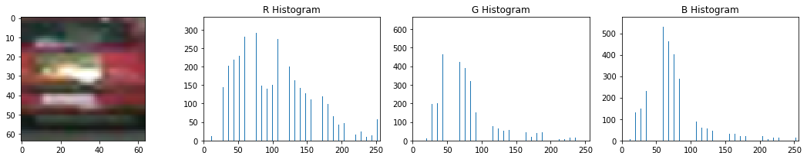

#### 4. Classifier

_The code for this step is in the "Train a classifier" section of the notebook._

I first set out 20% of the training data aside as my test data. Then, I extract a 1 dimensional feature vector for each image in my data, using HOG features and color histogram feature, in addition to image pixels itself. I then normalize these features to have zero mean and unit variance. Lastly, I trained a linear SVC on all the training data, obtaining 98% accuracy. I verifed that my classifer is not overfitting by calculating the test accuracy on test data. I got aronud 98% for test data as well, so we are good. I further verified the classifier performance by manually choosing two random images and check the prediction against ground truth:

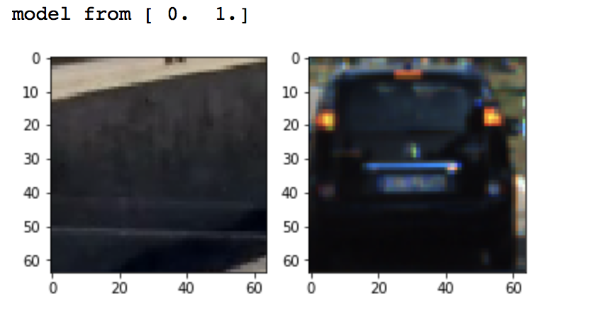

As we can see, it does a pretty good job.

### Sliding Window Search

_The code for this step is in the "Sliding Window Search" section of the notebook._

The high level idea is to search on the images with different bonding boxes, and classify whether there is a car in each sliding window. 

#### 1. Decide on scales and overlap windows to search 

First, I restrict all my search to be within [400, 680] for y axis and [600, 1250] for x axis, because only in these places will cars show up as they are the lane next to us. In this way, I can avoid more potential false postivies from sky and trees.

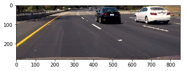

Then, I compared search window of size from [32, 32], [64, 64], and [128, 128], and here are the results.

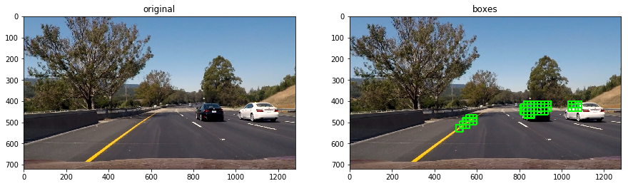

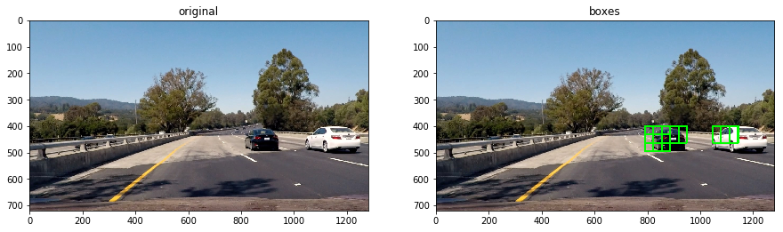

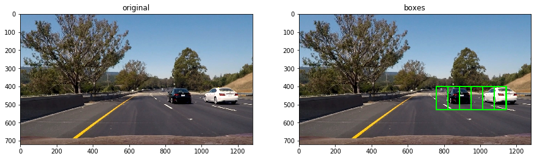

As we can see, as the window size increases, the bonding boxes become bigger but fewer in quantity. As the window size decreases, the bonding boxes become smaller but there are more false positives.

After that,  I compared overlap ratio from scanning continously or with a skip of few pixels in between the windows. 

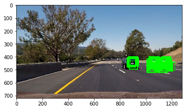

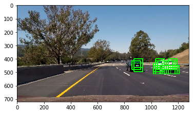

As we can see, the more closely we search, the more bonding boxes we generate around each car.

Since cars decrease in apparent size as they drive further away from us, it makes sense to search for the car in different window sizes.

Thus, after few experimentatinos, I decided to use both a window size of 64 with 16 pixels skip in between windows, and a window size of 96 with 12 pixels in between. I combine all of the bonding boxes from these two rounds of searching for further analysis.

#### 2. Optimize the performance of the classifier and pipeline

I experimented on different combination of parameters for HOG features, window size, and skip pixels. It turns out that the choice of parameter settings mentioned above work already well providing a nice result.  Here is an example:

However, there indeed are false positives in some frames like so:

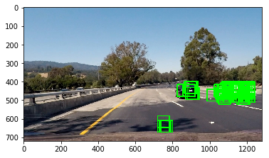

I went back to retrain the classifier with fewer images to avoid overffitting. After retrainning, the classifier has gotten much better at the task.

---

### Video Implementation

#### 1. Video output

Here's a [link to my video result](https://youtu.be/ogwdGtVbd40)

#### 2. Avoid false positives and combine overlapping bounding boxes

I recorded the positions of positive detections in each frame of the video.  From the positive detections I created a heatmap and then thresholded that map to identify vehicle positions.  I then used `scipy.ndimage.measurements.label()` to identify individual blobs in the heatmap.  I then assumed each blob corresponded to a vehicle, and constructed a main bounding box to cover the area of each blob detected.  

**Here the resulting bounding boxes drawn onto a frame**

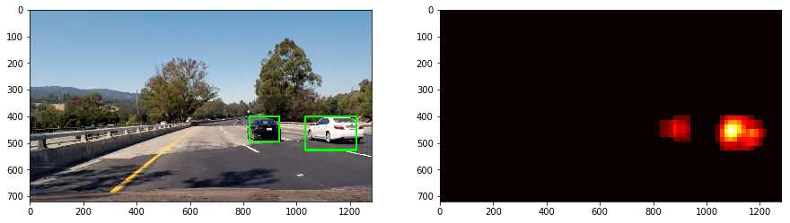

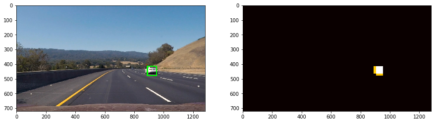

#### 3. Timeseries Tracking

Vehicles appeared in one frame should still be around at the same position in the next frame, so our bonding boxes should be approximately around same area. New vehicles also appear into our view from lower right half of the view, because we are on the left lane.

Therefore, I created a `VideoProcess` class where it does filtering on the bonding boxes generated from `slide window search` to further eliminate false positives.

- I manully chose a line that roughly fits the right lane line in the view, and reject any bonding boxes that have a box center laying on the left side of the line. In other words, I only consider a bonding box valid if it is capturing a potential vehicle candidate in the lane next to us.

- I keep track of roughly one-third of the bonding boxes found in each step, and insert them into the bonding boxes found for the next timestamp/frame, as a way of smoothing.

---

### Discussion

There are occasional false positives in the final result video still, so more tracking and smoothing techniques are required to reject false positives.

Also, the classifier will be more accurate and can eliminate more false positives if trained using a Convolutional Neural Network, since it's good for computer vision in general, so developing a pipeline integrating CNN will be an interesting next step. 

We can also use image augmentation techniques to generate more training data, but under different angles and lighting situations. A classifier trained on these new data will generalize better. The GTI dataset also tends to have time serires images of same car in a short amount of time, so it may lead the model to overfit. We can consider removing these as well.

The bonding boxes also wabble and change in size frequently, so it will be good visually to also have a pipeline to make the bonding box more stable and roughly in same size.

